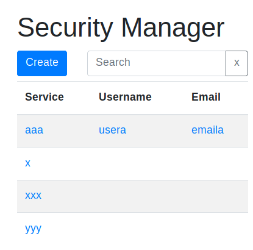

# security manager

Webapi + webapp personal wallet cloud 

## Summary

- [security manager](#security-manager)
  * [Summary](#summary)
  * [motivations and architecture overview](#motivations-and-architecture-overview)
  * [screenshoots](#screenshoots)
  * [features](#features)
  * [prerequisites](#prerequisites)
  * [setup](#setup)
  * [debug](#debug)
  * [code map](#code-map)
    + [webapi ( server )](#webapi--server-)
    + [js ( client )](#js--client-)
    + [docker ( container )](#docker--container-)
  * [nginx config example](#nginx-config-example)
  * [firewall rules](#firewall-rules)
  * [install execution example](#install-execution-example)

## motivations and architecture overview

- don't want your password stored into external cloud
  - have your own server with
    - nginx https ( [letsencrypt](https://letsencrypt.org/) ) valid certificate
    - docker container in separate dedicated network space (/30) with [custom firewall rules](https://github.com/devel0/linux-scripts-utils/blob/master/fw.sh)
- use of firefox browser ( browser password stored local and synced between your device, not device-cloud ; must backup your data )
- on your palm device access through browser https to the wallet with
  - password ( real random ) to protect against internet face ( browser can store that password )
  - pin ( 4 numbers ) to protect against wallet use ( browser can't store that pin )

## screenshoots





## features

- short list credentials ( service, username, email )
- filter list credentials by any field ( note included )
- edit credential ( add, edit, remove ) with changes detect and warn on unsave when close
- password copy to clipboard
- change master password, pin by editing "Security Manager" account
- password regenerate ( allow to set password length foreach record avoiding ambiguous chars 'I', 'l', '0', 'O' )

## prerequisites

- build [ubuntu bionic](https://github.com/devel0/docker-ubuntu/tree/bionic)
- build [dotnet bionic](https://github.com/devel0/docker-dotnet/blob/bionic/README.md)

note: to build `bionic` branch of prerequisites docker, after clone, exec `git checkout bionic`

## setup

- create a config json file with follow initial structure

```json
{
  "AdminPassword": "supersecret",
  "Pin": nnnn
}
```

replacing
- `supersecret` with a cleartext real random password
- `nnnn` with a 4 number pin

chmod that file 600 otherwise application generate an error

- increase security : encrypt your hard disk to avoid, if stolen, data can be read

- create a docker network

```
docker network create sec0 --subnet=10.10.0.56/30
```

- adjust the sample [config-sec0.json](docker/config-sec0.json) with your own `security_dbfile` place and `external_url` that is the real url
- create autorestarting container

```
cd ./docker
./run config-sec0.json
```

## debug

- prerequisites
  - [nodejs, local web server](https://github.com/devel0/docker-ubuntu/blob/db474a1a65638d42351bbefe318ffc47736b820b/Dockerfile#L21-L26)
  - bower ( install using `npm install -g bower` )
  - vscode ( suggested [extensions](https://github.com/devel0/knowledge/blob/daea0a3439467e882326ecc3a9e5fbd7d7b17441/tools/vscode-useful-extensions.md) )
  - firefox ( debug [settings](https://github.com/devel0/knowledge/blob/daea0a3439467e882326ecc3a9e5fbd7d7b17441/webdevel/vscode-debug-firefox.md) )

- vscode and start **webapi server**

```
cd ./SecurityManagerWebapi
code . &
```

and hit F5 `.NET Core Launch (console)` after Omnisharp initializes

- close firefox and start firefox debug using `firefox --start-debugger-server` ( may useful to disable breakpoint on unhandled exception from F12 to avoid occasional thirdy pages browsing breakpoint )

- vscode and start **web server**

```
cd ./SecurityManagerClient
bower install --allow-root
code . &
ws -p 8000 --spa index.html
```

and hit F5 `Launch localhost`

- browse http://localhost:8000 from opened firefox debug window

- notes:
  - breakpoint will work on webapi and client javascript

## code map

### webapi ( server )

|**section**|**description**|
|---|---|
| [Global](SecurityManagerWebapi/Global.cs) | path names and logging functions |
| [LinuxHelper](SecurityManagerWebapi/LinuxHelper.cs) | unix syscall mapping through Mono.Posix.NETStandard net core library |
| Startup,Program | standard from `dotnet new webapi` |
| [Types/Common](SecurityManagerWebapi/Types/Common.cs) | common json request data structure |
| [Types/CommonResponse](SecurityManagerWebapi/Types/CommonResponse.cs) | common json response data structure |
| [Types/Config](SecurityManagerWebapi/Types/Config.cs) | dbfile structure - will json (de)serialized |
| [Types/CredInfo](SecurityManagerWebapi/Types/CredInfo.cs) | base dbfile record type - credential record and json file locking add/remove record, save |
| [Controllers/ApiController](SecurityManagerWebapi/Controllers/ApiController.cs) | server side api implementation |

### js ( client )

|**section**|**description**|
|---|---|
| [site.css](SecurityManagerClient/site.css) | website custom css |
| [bower.json](SecurityManagerClient/bower.json) | file populated initially with `bower init` and then with `bower install dep --save` containing js libraries dependencies |
| js-utils.js | js utils from [js-util.js](https://github.com/devel0/js-util/blob/master/src/js-util.js) |
| [utils.js](SecurityManagerClient/utils.js) | minor app utils |
| [app.js](SecurityManagerClient/app.js) | main client-side SPA app logic |
| [index.html](SecurityManagerClient/index.html) | graphics markup |

### docker ( container )

|**section**|**description**|
|---|---|
| [replace-token-with](docker/replace-token-with) | c# util to replace text in files ( sed -i makes it difficult when escaping ) |
| [config-sec0.json](docker/config-sec0.json) | example docker container config file ) |
| [run.sh](docker/run.sh) | create docker container |
| [entrypoint.sh](docker/entrypoint.sh) | every restart entry script that compile and install first time from source distro into binary and that start local web server + webapi server everytime |

## nginx config example

- `/etc/nginx/nginx.conf`

```
events
{
}

http {
        index index.html;

        # comment follow line to decrease warning log to only show errors
        error_log /var/log/nginx/error.log warn;
        
        client_max_body_size 5120M;
        proxy_connect_timeout 1600;
        proxy_send_timeout 1600;
        proxy_read_timeout 1600;
        send_timeout 1600;

        server {
                listen 80 default_server;
                listen [::]:80 default_server;
                server_name _;
                rewrite ^ https://$host$request_uri? permanent;
        }

        ssl_certificate /etc/ssl/certs/searchathing.com.crt;
        ssl_certificate_key /etc/ssl/private/searchathing.com.key;
        ssl_protocols TLSv1.2;

        server {
                listen 443 ssl default_server;
                listen [::]:443 ssl default_server;

                root /var/www/html;

                server_name searchathing.com www.searchathing.com;

                location / {
#                       try_files $uri $uri/;
                        access_log /logs/web_access.log;
                }
        }

        include /etc/nginx/conf.d/*.conf;
}
```

- `/etc/nginx/conf.d/sec0.conf`

```
server {
        listen 443 ssl;
        listen [::]:443 ssl;

        root /var/www/html;

        server_name sec0.searchathing.com;

        location / {
                proxy_set_header Host $host;
                proxy_pass http://10.10.0.58:80;
        }

        location ~ /Api/(?<ns>.*) {
                proxy_set_header Host $host;
                proxy_pass http://10.10.0.58:5000/Api/$ns?$args;
                proxy_set_header X-Real-IP $remote_addr;
                proxy_set_header X-Forwarded-For $proxy_add_x_forwarded_for;
        }
}
```

## firewall rules

if using [fw.sh](https://github.com/devel0/linux-scripts-utils/blob/master/fw.sh) insert follow rules (replacing net_sec0, ip_sec0_srv accordingly to your [docker network](https://github.com/devel0/knowledge/blob/master/linux/quick-and-dirty-server-install-notes.md#create-docker-networks)):

```sh
net_sec0="10.10.0.56/30"

ip_sec0_srv="10.10.0.58"

if_dksec0=$(dk-if sec0)

comment="http nginx -> sec0 (80,5000)"
accept FORWARD-2 -i $if_dknginx -o $if_dksec0 -s $ip_nginx_srv -d $ip_sec0_srv -p tcp -m multiport --dports $svc_http,5000

#============
# dksec0
#============

comment="dns from sec0 to dns (udp)"
accept FORWARD-2 -i $if_dksec0 -o $if_dkdns -s $ip_sec0_srv -d $ip_dns_srv -p udp --dport $svc_dns

comment="dns from sec0 to dns (tcp)"
accept FORWARD-2 -i $if_dksec0 -o $if_dkdns -s $ip_sec0_srv -d $ip_dns_srv -p tcp --dport $svc_dns

comment="http(s) from sec0"
accept FORWARD-2 -i $if_dksec0 -s $ip_sec0_srv -p tcp -m multiport --dports $svc_http,$svc_https
```

## install execution example

```sh
searchathing root@main:/opensource/devel0/securitymanager/docker# ll
total 28
drwxr-xr-x 3 root root 4096 giu 14 16:13 ./
drwxr-xr-x 7 root root 4096 giu 14 16:13 ../
-rw-r--r-- 1 root root  188 giu 14 16:13 config-sec0.json
-rw-r--r-- 1 root root  188 giu 14 16:13 config-sec1.json
-rwxr-xr-x 1 root root 1337 giu 14 16:13 entrypoint.sh*
drwxr-xr-x 2 root root 4096 giu 14 16:13 replace-token-with/
-rwxr-xr-x 1 root root 1387 giu 14 16:13 run.sh*
searchathing root@main:/opensource/devel0/securitymanager/docker# ./run.sh config-sec0.json 
container [sec0]
docker network [sec0]
container ip [10.10.0.58]
urlbase [https://sec0.searchathing.com]
dbfile [/security/sec0.json]

---> press a key to continue or ctrl+c to break


---> removing previous container if exists

sec0
sec0
579c4c5d33f93af58b6b8c30dfb6815d16c33b1ca4b6719c065c07909bb6f7b0

---> Executing entrypoint [/entrypoint.d/start.sh]

---> copying distro src to /opt


---> building replace-token-with utility


Welcome to .NET Core!
---------------------
Learn more about .NET Core: https://aka.ms/dotnet-docs
Use 'dotnet --help' to see available commands or visit: https://aka.ms/dotnet-cli-docs

Telemetry
---------
The .NET Core tools collect usage data in order to help us improve your experience. The data is anonymous and doesn't include command-line arguments. The data is collected by Microsoft and shared with the community. You can opt-out of telemetry by setting the DOTNET_CLI_TELEMETRY_OPTOUT environment variable to '1' or 'true' using your favorite shell.

Read more about .NET Core CLI Tools telemetry: https://aka.ms/dotnet-cli-telemetry

ASP.NET Core
------------
Successfully installed the ASP.NET Core HTTPS Development Certificate.
To trust the certificate run 'dotnet dev-certs https --trust' (Windows and macOS only). For establishing trust on other platforms refer to the platform specific documentation.
For more information on configuring HTTPS see https://go.microsoft.com/fwlink/?linkid=848054.
Microsoft (R) Build Engine version 15.7.179.6572 for .NET Core
Copyright (C) Microsoft Corporation. All rights reserved.

  Restoring packages for /opt/securitymanager/docker/replace-token-with/replace-token-with.csproj...
  Installing Microsoft.NETCore.DotNetAppHost 2.0.0.
  Installing Microsoft.NETCore.DotNetHostResolver 2.0.0.
  Installing NETStandard.Library 2.0.0.
  Installing Microsoft.NETCore.DotNetHostPolicy 2.0.0.
  Installing Microsoft.NETCore.App 2.0.0.
  Generating MSBuild file /opt/securitymanager/docker/replace-token-with/obj/replace-token-with.csproj.nuget.g.props.
  Generating MSBuild file /opt/securitymanager/docker/replace-token-with/obj/replace-token-with.csproj.nuget.g.targets.
  Restore completed in 6.38 sec for /opt/securitymanager/docker/replace-token-with/replace-token-with.csproj.
  replace-token-with -> /opt/securitymanager/docker/replace-token-with/bin/Debug/netcoreapp2.0/replace-token-with.dll

Build succeeded.
    0 Warning(s)
    0 Error(s)

Time Elapsed 00:00:08.64

---> setup webapi url to [https://sec0.searchathing.com]


---> building web api server

Microsoft (R) Build Engine version 15.7.179.6572 for .NET Core
Copyright (C) Microsoft Corporation. All rights reserved.

Build started 6/14/18 3:00:12 PM.

Build succeeded.
    0 Warning(s)
    0 Error(s)

Time Elapsed 00:00:00.43
  Restoring packages for /opt/securitymanager/SecurityManagerWebapi/SecurityManagerWebapi.csproj...
  Restoring packages for /opt/securitymanager/SecurityManagerWebapi/SecurityManagerWebapi.csproj...
  Installing Microsoft.IdentityModel.Logging 1.1.4.
  Installing Microsoft.IdentityModel.Tokens 5.1.4.
  ...  
  Installing System.Text.Encoding.CodePages 4.0.1.
  Installing Microsoft.Build.Utilities.Core 15.3.409.
  Generating MSBuild file /opt/securitymanager/SecurityManagerWebapi/obj/SecurityManagerWebapi.csproj.nuget.g.props.
  Generating MSBuild file /opt/securitymanager/SecurityManagerWebapi/obj/SecurityManagerWebapi.csproj.nuget.g.targets.
  Restore completed in 23.84 sec for /opt/securitymanager/SecurityManagerWebapi/SecurityManagerWebapi.csproj.
  Restore completed in 24.19 sec for /opt/securitymanager/SecurityManagerWebapi/SecurityManagerWebapi.csproj.
Microsoft (R) Build Engine version 15.7.179.6572 for .NET Core
Copyright (C) Microsoft Corporation. All rights reserved.

  Restore completed in 22.26 ms for /opt/securitymanager/SecurityManagerWebapi/SecurityManagerWebapi.csproj.
  Restore completed in 75.86 ms for /opt/securitymanager/SecurityManagerWebapi/SecurityManagerWebapi.csproj.
  SecurityManagerWebapi -> /opt/securitymanager/SecurityManagerWebapi/bin/Release/netcoreapp2.0/SecurityManagerWebapi.dll

Build succeeded.
    0 Warning(s)
    0 Error(s)

Time Elapsed 00:00:02.61

---> run webapi server


---> run web server


===> app ready ( ctrl+c to stop log )

[docker 579c4c5d33f9:/]# Serving at http://579c4c5d33f9:80, http://127.0.0.1:80, http://10.10.0.58:80
warn: Microsoft.AspNetCore.DataProtection.KeyManagement.XmlKeyManager[35]
      No XML encryptor configured. Key {7344b722-09a5-4c98-87e3-9e95bafa18c6} may be persisted to storage in unencrypted form.
Hosting environment: Production
Content root path: /opt/securitymanager/SecurityManagerWebapi
Now listening on: http://0.0.0.0:5000
Application started. Press Ctrl+C to shut down.
```
